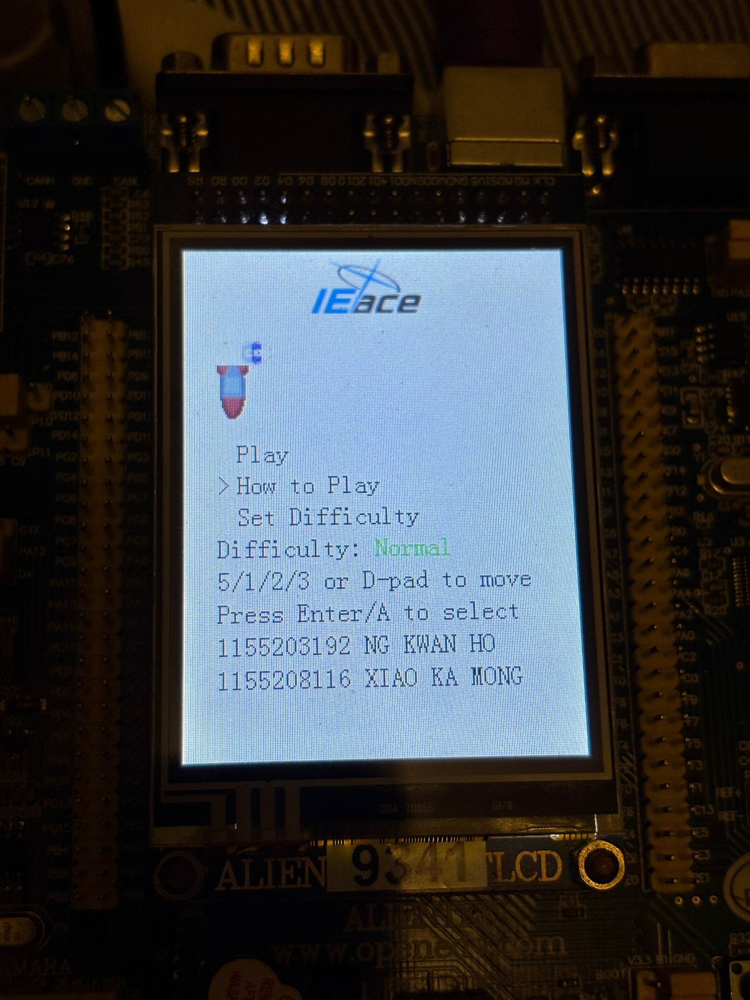
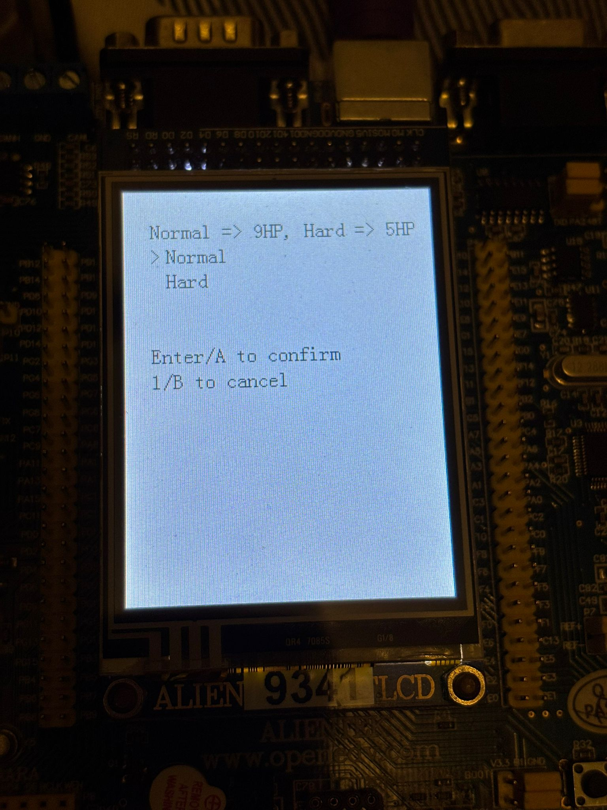
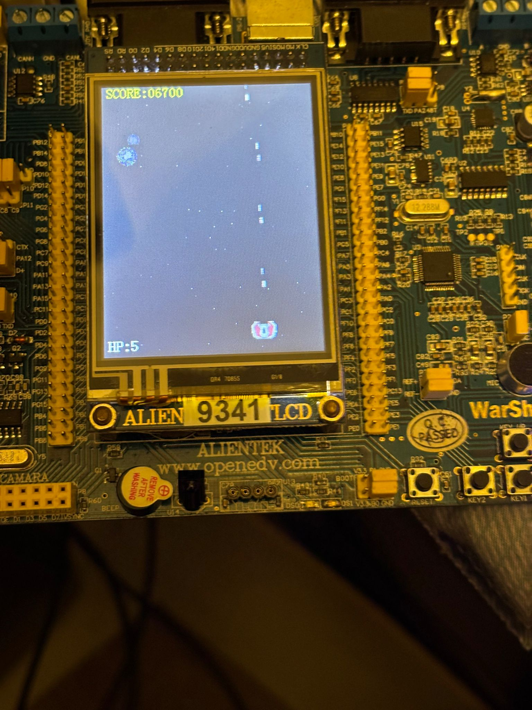
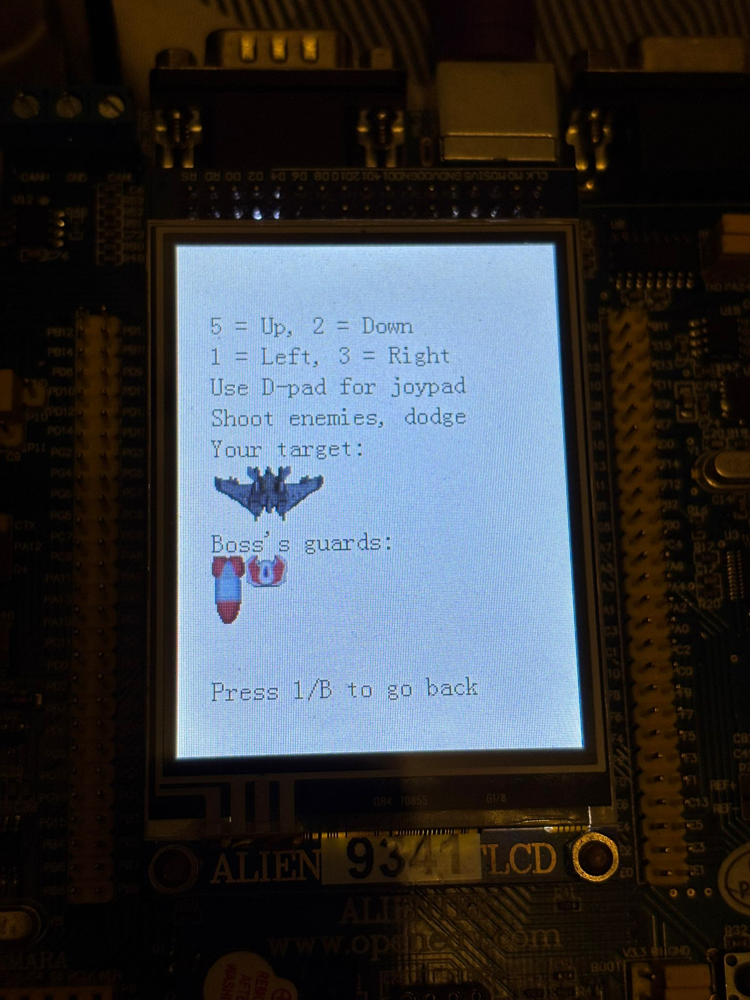
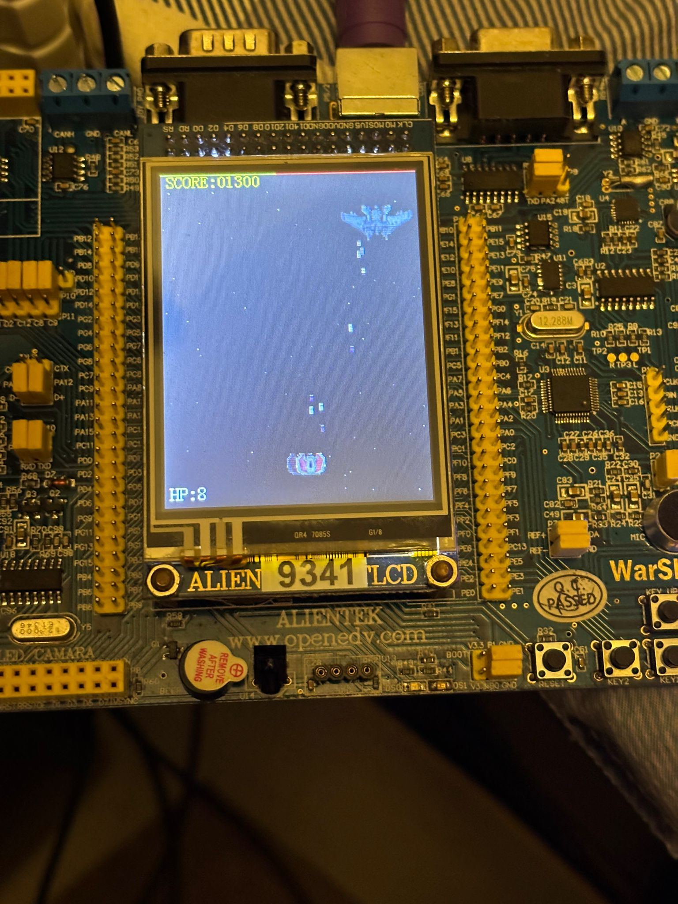
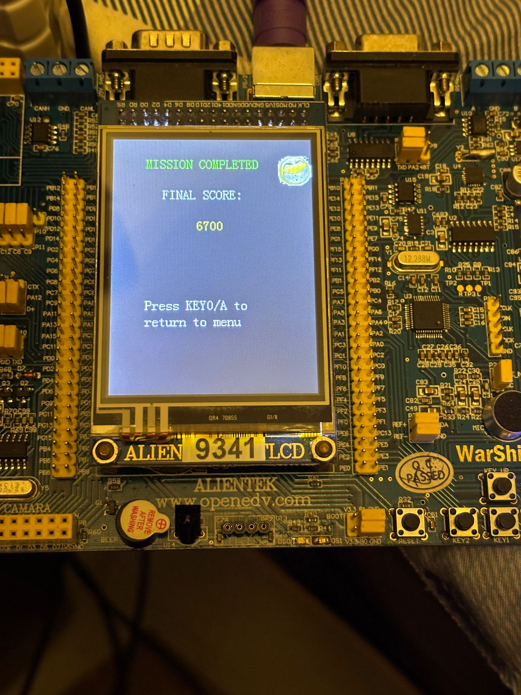
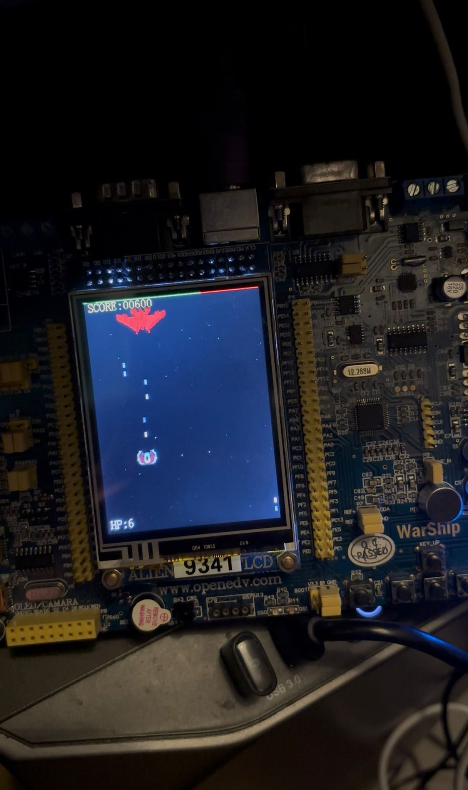

# IEace - STM32 Vertical Scrolling Shooter

# NOTE THIS README IS "VIBE-WRITTEN" USING GENERATIVE AI :D

<p align="center">
  
</p>

A classic **vertical-scrolling shoot 'em up (STG)** game implemented entirely in C on an **STM32F103ZET6** ARM Cortex-M3 microcontroller on an ALIENTEK Warship V2 board. This project was part of my assessment in IERG3810 at CUHK.

## 🎮 Features

- **Real-time gameplay** at ~30 FPS on a 72MHz Cortex-M3
- **6 game states**: Boot → Menu → Tutorial → Play → Game Over
- **Multiple enemy types** with distinct movement patterns (straight, zigzag, boss)
- **Boss battle** with special attack patterns
- **Dual input support**: PS/2 Keyboard + NES-style JoyPad
- **PWM-driven audio** with background music playback
- **AABB collision detection** for bullets and enemies

## 📸 Game Screenshots

<p align="center">
  
  
  
  
  
  

## 🛠️ Hardware Spec

| Component | Specification |
|-----------|---------------|
| MCU | STM32F103ZET6 (ARM Cortex-M3, 72MHz, 512KB Flash, 64KB SRAM) |
| Display | ILI9341 TFT LCD (240×320, 16-bit RGB565, FSMC interface) |
| Input | PS/2 Keyboard, NES-style JoyPad (directly connected) |
| Audio | Active Buzzer (PWM-driven via TIM4_CH3 on PB8) |

### Pin Configuration

| Peripheral | Pins | Description |
|------------|------|-------------|
| TFT LCD (FSMC) | PD0,1,8-10,14,15; PE7-15; PG0,12 | 16-bit parallel data bus |
| TFT Backlight | PB0 | LCD backlight control |
| PS/2 Keyboard | PC10 (Data), PC11 (Clock/EXTI) | Interrupt-driven input |
| NES JoyPad | PC8 (Latch), PC9 (Data), PC12 (Clock) | Bit-banged serial |
| Buzzer | PB8 | TIM4 Channel 3 PWM output |

## 📁 Project Structure

```
├── Board/                      # Game modules and hardware drivers
│   ├── GameState.c/h           # Finite state machine controller
│   ├── Play.c/h                # Main gameplay logic
│   ├── Enemy.c/h               # Enemy spawning and AI
│   ├── Bullet.c/h              # Bullet pool management
│   ├── Collision.c/h           # AABB collision detection
│   ├── Stage.c/h               # Level progression
│   ├── Menu.c/h                # Menu system
│   ├── BootScreen.c/h          # Boot screen display
│   ├── GameOver.c/h            # Game over screen
│   ├── GameUI.c/h              # In-game UI rendering
│   ├── Background.c/h          # Scrolling background
│   ├── Explosion.c/h           # Explosion effects
│   ├── Audio.c/h               # PWM audio and BGM playback
│   ├── PS2Keyboard.c/h         # Interrupt-driven PS/2 driver
│   ├── JoyPad.c/h              # NES controller driver
│   ├── Resource.c/h            # Sprite and asset definitions
│   ├── SysTick.c/h             # System tick and heartbeat timer
│   ├── Delay.c/h               # Delay utilities
│   ├── IERG3810_TFTLCD.c/h     # FSMC LCD driver
│   ├── IERG3810_Buzzer.c/h     # Buzzer control
│   ├── IERG3810_Clock.c/h      # System clock configuration
│   ├── IERG3810_EXTI.c/h       # External interrupt handling
│   ├── IERG3810_KEY.c/h        # Key input handling
│   ├── IERG3810_LED.c/h        # LED control
│   ├── IERG3810_NVIC.c/h       # Nested interrupt controller
│   ├── IERG3810_USART.c/h      # USART communication
│   ├── CFONT.h / FONT.H        # Font definitions
│   └── th06_06.h               # Music data (Touhou BGM)
├── Core/                       # CMSIS and startup files
│   ├── startup_stm32f10x_hd.s  # Startup assembly
│   ├── core_cm3.c/h            # Cortex-M3 core functions
│   ├── stm32f10x.h             # Device header
│   └── system_stm32f10x.c/h    # System initialization
├── Fw_lib/                     # STM32 Standard Peripheral Library
│   ├── inc/                    # Header files (GPIO, TIM, FSMC, etc.)
│   └── src/                    # Source files
├── User/                       # Application entry point
│   ├── miniProjectMain.c       # Main function and task scheduler
│   ├── stm32f10x_conf.h        # Peripheral configuration
│   └── stm32f10x_it.c/h        # Interrupt handlers
├── Objects/                    # Compiled object files
└── Listings/                   # Assembly listings
```

## 🏗️ Architecture

### Task Scheduling

The game uses a cooperative multitasking model with a custom heartbeat timer:

| Task | Interval | Purpose |
|------|----------|---------|
| `Task_Input` | 10 ms | Poll keyboard/joypad, dispatch events |
| `Task_Logic` | 10 ms | Update physics, collisions, game state |
| `Task_Render` | 33 ms | Render sprites, UI, background (~30 FPS) |

### State Machine

```
BOOT → MENU → PLAY
        ↑       ↓
        └── GAMEOVER
```

### Key Technical Highlights
- **Timer-based PWM audio**: TIM4 generates variable frequency square waves
- **Object pooling**: Pre-allocated enemy and bullet arrays for zero runtime allocation

## 🔧 Building the Project

### Prerequisites before building

- **Keil µVision 5** (MDK-ARM)
- **STM32F10x Device Pack**


## 🎮 Controls

### PS/2 Keyboard

| Key | Action |
|-----|--------|
| Arrow Keys | Move spacecraft |
| Z | Fire |
| Enter | Confirm / Start |
| ESC | Pause |

### NES JoyPad

| Button | Action |
|--------|--------|
| D-Pad | Move spacecraft |
| A | Fire |
| Start | Confirm / Pause |


---